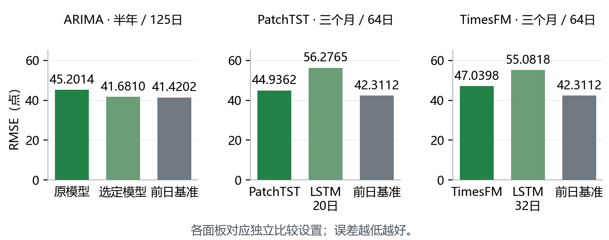
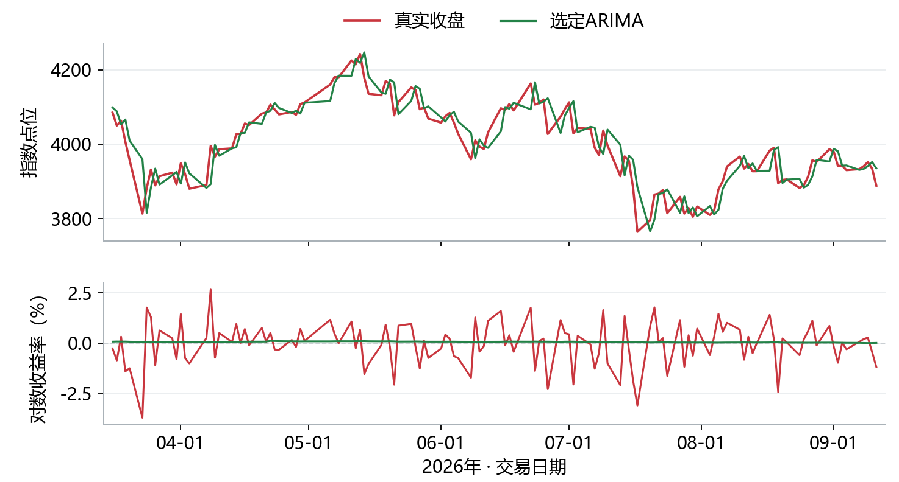
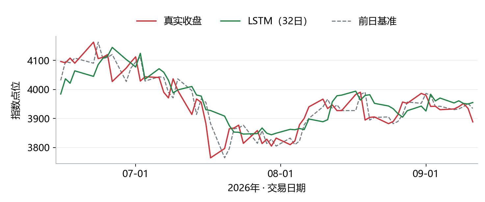
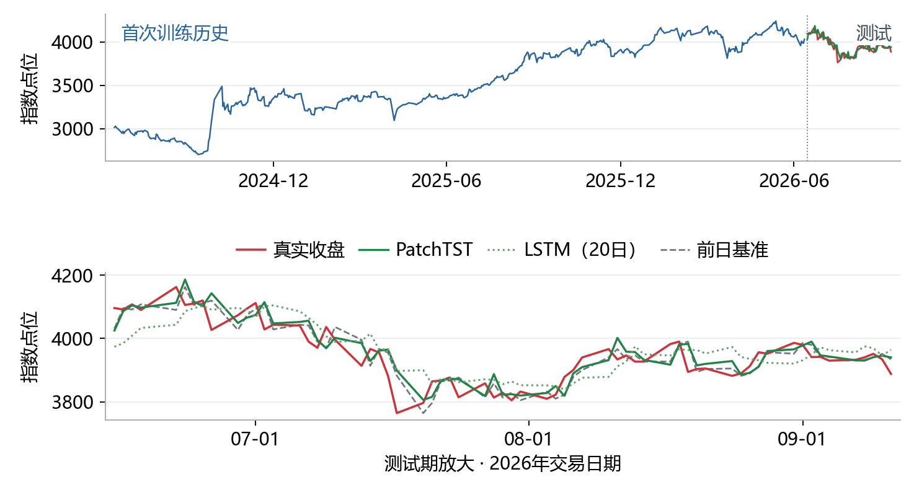
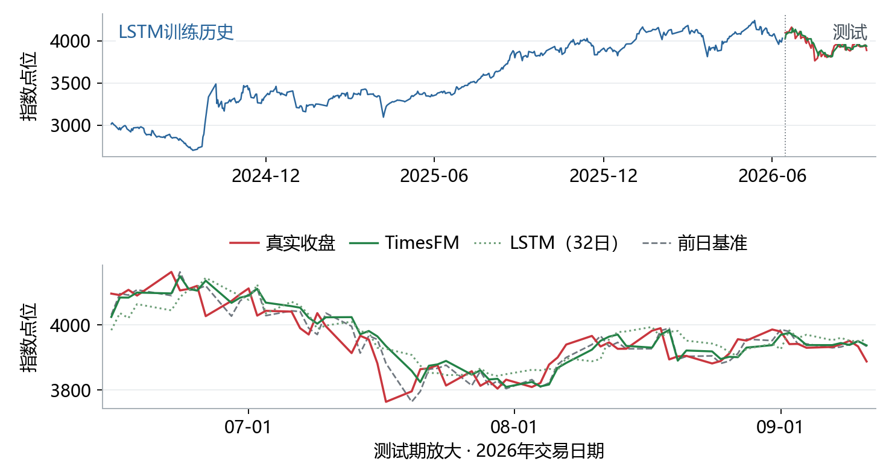
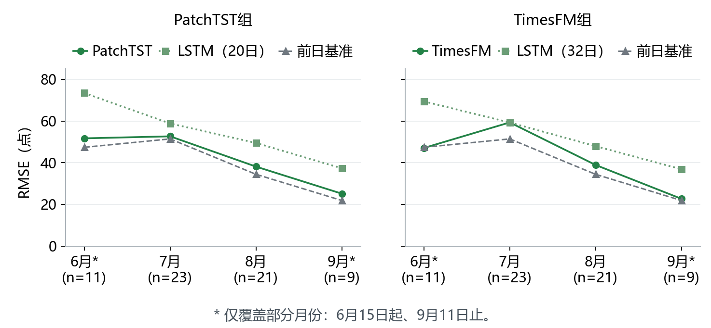

# 上证指数预测实验方法与结论

ARIMA · LSTM · PatchTST · TimesFM 2.5

本仓库将上证指数预测实验整理为可复核的代码、结果与图文报告。PatchTST 使用原作者实现，TimesFM 使用 Google Research 官方预训练模型；模型来源及许可见 [第三方声明](THIRD_PARTY_NOTICES.md)。

[阅读原版 PDF](reports/experiment-report.pdf) · [运行方法](#七-运行与复现) · [核验原实验结果](results/reference/)

报告日期：2026年9月20日。实验行情截至2026年9月11日。研究对象为上证指数日线，重点检验模型能否预测下一交易日收盘，而不是仅仅画出贴近历史的曲线。

**主要结论：复杂模型尚未稳定超过简单基准。** ARIMA改进后优于原版；PatchTST和TimesFM 2.5分别优于对应的LSTM，但三组主模型的整体点位误差都高于“下一日等于前日收盘”的基准。这个结论仅适用于已完成的实验设置与历史区间。



图1  按实验条件分别展示RMSE。各面板内部可以比较；ARIMA测试区间与后两组不同，后两组输入长度和训练方式也不同，不构成统一的架构排名。

| 方法 | 学习方式 | 本轮重点 |
| --- | --- | --- |
| ARIMA | 传统统计时间序列模型 | 检查差分、阶数和训练窗口 |
| LSTM | 带门控记忆的循环神经网络 | 从课堂示例发展为逐日重训对照 |
| PatchTST | 把序列分片后使用Transformer | 小模型在本地历史上从头训练 |
| TimesFM 2.5 | 预训练时间序列Transformer | 冻结官方权重直接预测 |

### 如何阅读这份报告

先看数据切分与预测任务，再看四个模型的方法、实际曲线与误差，最后看结论边界。表中的RMSE和MAE都以指数点为单位，越低越好。方向准确率与投资收益是不同评价对象。

## 一 数据与实验设计

同一行情快照  严格按时间取用历史信息

数据来自已保存的Yahoo Finance上证指数日线快照，代码为000001.SS。本文整理原有实验，不更新行情、不重新挑选测试日。后期配对实验统一使用Close；早期LSTM还探索过开盘价、最高价和成交量等输入。

| 实验 | 复核区间与样本 | 预测时已知的信息 |
| --- | --- | --- |
| ARIMA改进 | 2026-03-16至09-11 / 125个交易日 | 窗口内历史日对数收益 / 126条、252条或扩展窗口 |
| PatchTST与LSTM | 2026-06-15至09-11 / 64个交易日 | 此前两年训练 / 最近20个连续交易日输入 |
| TimesFM与LSTM | 2026-06-15至09-11 / 64个交易日 | 最近32日输入；LSTM用两年训练 / TimesFM使用冻结预训练权重 |

### 训练历史和输入窗口分别决定什么

“两年训练历史”用于形成大量训练案例；“20日或32日输入”是每个案例所观察的近期长度。例如，为预测6月15日，LSTM只使用6月12日及以前的数据；32日输入覆盖4月27日至6月12日。到了下一个目标日，窗口随日期前移。

### 滚动单步预测的顺序

第一步，截取目标日前的真实历史。第二步，拟合或载入模型，并输出下一交易日预测。第三步，将预测与对应日期的真实收盘对齐评分。进入下一目标日后，才允许把刚发生的真实行情加入历史。图中的三个月预测线是64次单步预测的连接，并非一次预测未来三个月。

### 验证阶段如何与评分阶段分开

ARIMA的18个候选只在更早的2025-03-14至2026-03-13验证期选择。后期LSTM与PatchTST每天把历史窗口最后40个目标日作为内部验证，在最多40轮中选择轮数；随后重新初始化，在全部已知两年历史上重训。验证阶段的标准化不使用验证目标日的数据。TimesFM本轮不微调、不按测试误差挑选参数。

### 评价指标与基准

**前日收盘基准：**预测收盘＝前一交易日实际收盘。
**MAE：**各日绝对误差的平均，表示通常偏离多少点。
**RMSE：**误差平方的平均再开平方，对较大的预测偏差更敏感。

这些日期已在此前研究中查看，因此本文称其为历史复核。时间切分可阻止当天真实值进入当天预测。反复研究同一时期仍可能带来选择偏差。

## 二 ARIMA实验

先检查差分  再比较少量参数和训练窗口

**原理与目标：**ARIMA用历史值和历史预测误差建立线性模型，d表示差分次数。本项目先计算日对数收益log（当日收盘 / 前日收盘），预测收益后用“前日收盘×exp(预测收益)”还原指数点位。原版ARIMA(5,1,0)每天扩展历史、重新拟合并预测次日。

**改进方法：**对收益再设d＝1可能造成额外差分。用ADF、KPSS及自相关检查，再固定6种结构×3种窗口，共18个候选；窗口为126条收益、252条收益或扩展窗口。只按更早验证期的点位RMSE选择，结果为ARIMA(0,0,0)含常数、252条收益窗口，实质是历史平均收益。



图2  半年125次逐日预测。上图为点位，下图为日对数收益。预测收益接近零时，还原后的点位仍会跟随前日收盘变化，点位曲线贴近并不代表抓住了次日涨跌。

| 方法 | RMSE | MAE |
| --- | --- | --- |
| 原ARIMA(5,1,0) | 45.20 | 35.34 |
| 选定252条收益均值 | 41.68 | 31.48 |
| 前日收盘基准 | 41.42 | 31.46 |

**结论：**相对原版RMSE下降7.79%，但比基准高0.63%。原实验的区块bootstrap结果也未确认相对基准的稳定优势。收益均值在125天中始终预测上涨，54.4%的方向准确率等于该时期上涨日比例，不能解释为学会了有效择时。

## 三 LSTM实验

从课堂循环网络示例到每日重训对照

**原理：**LSTM是RNN的一种，通过输入、遗忘和输出门控制历史信息的保留。它可以学习非线性序列关系。文件名中写RNN的课堂示例实际使用LSTM层，因此本文不把它们重复列作独立模型。

**实验演变：**先演示单变量、多变量与20步预测，再复现DataFactory的Open、Volume、Close输入及25步输出；随后改成半年滚动训练、每天预测次日。后期为匹配PatchTST和TimesFM，统一到两年训练历史，并分别重做20日和32日Close输入版本。早期多步误差不与后期次日误差直接排名。

**后期结构：**LSTM 32单元 → LSTM 16单元（ReLU）→ Dense 1。每日只用过去数据；内部验证选择训练轮数后，重新初始化模型、优化器和全历史标准化，再拟合全部已知训练样本。



图3  32日输入版本的64次次日预测。绿色为本轮重新训练的LSTM，红色为真实收盘，灰色为前日收盘基准。部分拐点附近出现滞后和较大偏差。

| 同一64日期 | RMSE | MAE |
| --- | --- | --- |
| 两年训练＋20日输入 | 56.28 | 46.51 |
| 两年训练＋32日输入 | 55.08 | 43.43 |
| 前日收盘基准 | 42.31 | 32.26 |

**结论：**32日版本在本次记录中略优于20日版本，两者均未超过前日收盘基准。32日版本有19/64个目标日选到了40轮上限，说明结论受到当前训练预算限制；不能推断所有LSTM配置都无效。

## 四 PatchTST实验

在本地历史上训练的小型Transformer

**原理：**PatchTST先把时间序列切成片段，再利用注意力机制学习片段间关系。本项目采用作者官方监督学习实现，没有加载预训练权重。最近20日按长度5、步长3切成6个重叠片段。

**实验设置：**2层Transformer、4个注意力头、d_model＝32，共17,667个参数；采用官方RevIN与LayerNorm。每天在此前两年Close上训练，用相同20日输入与LSTM配对比较。两者使用相同的验证轮数选择规则，但归一化和框架等细节仍有差异。



图4  上图左侧是首次预测的两年训练历史，右侧为64日测试区；下图放大测试区。绿色实线为PatchTST，浅绿点线为同20日输入LSTM，红线为真实收盘，灰线为基准。

| 同为20日输入 | RMSE | MAE |
| --- | --- | --- |
| PatchTST | 44.94 | 32.93 |
| LSTM | 56.28 | 46.51 |
| 前日收盘基准 | 42.31 | 32.26 |

**结论：**PatchTST的RMSE比对应LSTM低20.15%，但比基准高6.20%。四个按月区间都优于LSTM，却都没有超过基准。当前支持“小型PatchTST优于这版LSTM”，不支持“注意力机制已带来可交易的预测优势”。

## 五 TimesFM 2.5实验

冻结预训练权重并直接进行次日预测

**原理：**TimesFM 2.5是Google的通用预训练时间序列模型。与本地从头训练的PatchTST不同，它已从外部数据学习序列规律；本轮冻结权重，用新输入直接预测，即zero-shot推理。它并非专为上证指数训练。

**实验设置：**使用官方PyTorch版，固定2025年公开的权重；每次输入32个真实收盘，预测下一交易日。官方点预测取中位数通道。LSTM也按32日输入重新训练，日期、真实值和基准与20日组完全一致。TimesFM没有用左侧两年历史训练或微调。



图5  左侧蓝线仅表示LSTM首次训练历史。TimesFM绿线由64次单步预测连接而成；每次只读取目标日前32个真实收盘。下图与32日LSTM和基准对照。

| 同为32日输入 | RMSE | MAE |
| --- | --- | --- |
| TimesFM 2.5 | 47.04 | 34.65 |
| LSTM | 55.08 | 43.43 |
| 前日收盘基准 | 42.31 | 32.26 |

**结论：**TimesFM的RMSE比本轮LSTM低14.60%，但比基准高11.18%。方向准确率57.81%，与“始终预测上涨”的方向基准持平（37/64），单凭这个数字也不能证明择时价值。两者的训练信息不同，结果差异不能只归因于架构。

## 六 综合结论与后续验证

先确认是否存在预测增益  再决定是否增加复杂度

**可以确认：**在本次已查看的历史区间和固定配置下，修正ARIMA设定、小型PatchTST以及TimesFM预训练推理，都能改善对应对照模型的部分误差；但各自主比较中的整体RMSE仍高于前日收盘基准。



图6  两组64日实验的按月RMSE。6月与9月仅覆盖部分月份。PatchTST四个区间均未超过基准；TimesFM仅6月略低于基准，其余区间高于基准。

### 图像贴近与有效预测之间的区别

指数点位带有很强的前日参照，模型跟随最近点位也可能画出看似贴近的曲线。真正需要检验的是相对基准的新增预测信息。曲线形状、误差下降、方向命中和扣除成本后的盈利，是不同层次的证据。当前实验没有验证可盈利的交易策略。

### 结论的适用边界

- 样本期较短且反复查看；没有全新的、完全未接触的最终测试期。

- 20日与32日输入不同，预训练与本地训练的信息也不同；不能做全模型的公平架构排名。

- 局部月度胜出和方向准确率不能证明长期稳定优势，当前训练预算与随机种子也有限。

### 建议的下一步

冻结当前配置与评价规则，在新增、未用于调参的日期继续滚动检验；同时报告点位误差、收益误差和方向基准。若后续建立交易策略，再单独验证换手、成本、滑点与最大回撤。现阶段优先检验信息与验证设计，而不是继续扩大模型。

### 结果来源与复现记录

- ARIMA：[原始与改进结果](results/reference/arima/)。
- LSTM 与 PatchTST：[20 日输入配对结果](results/reference/patchtst/)。
- TimesFM 与 LSTM：[32 日输入配对结果](results/reference/timesfm/)。
- [发布归档清单与校验值](results/reference/manifest.json)。

上述图表来自已完成实验的真实预测记录。PDF 保留原报告内容；其中 `sse-*-20260914` 是原实验目录名，在本仓库分别对应上述归档目录。归档数据可以离线重新计算误差。重新训练写入 `runs/`，不会覆盖本文结果。

## 七 运行与复现

### 先核验报告中的结果

下载或克隆仓库后，在仓库根目录运行：

```bash
python scripts/verify_results.py
```

这一步仅使用 Python 标准库，不下载行情、不训练网络：重新计算 18 个 MAE/RMSE 指标，核验时间顺序、两组实验共同的真实收盘与前日基准，并检查 14 份归档 JSON、6 幅图和 PDF 的哈希。

### 安装环境与准备行情

本次发布验证使用 Windows、Python 3.12 和 CPU。依赖按本地已验证版本固定；脚本使用仓库相对路径和当前 Python 解释器。其他操作系统及全新环境安装尚未逐一实测，框架版本或硬件差异可能改变神经网络的数值结果。

```bash
python -m venv .venv
```

Windows PowerShell 激活：`.\.venv\Scripts\Activate.ps1`；macOS/Linux 激活：`source .venv/bin/activate`。以下命令均在已激活的环境、仓库根目录执行。

```bash
python -m pip install -r requirements/base.txt
python scripts/fetch_data.py
```

下载固定区间 `2023-03-01` 至 `2026-09-11` 的 `000001.SS` 日线，保存到本机 `data/yahoo_sse.json`。已有缓存会保留；需要替换时显式加 `--force`。也可以导入已有快照：

```bash
python scripts/fetch_data.py --from-file /path/to/yahoo_raw.json
```

Yahoo 可能限流或修订历史数据。程序校验行情，并记录规范化日期/收盘价指纹；新下载数据不保证与原实验快照完全相同。参考指纹见 [manifest.json](results/reference/manifest.json)。这些入口复现固定的历史实验，修改股票或日期还需同步调整协议与样本数。

### ARIMA

```bash
python experiments/arima/run_all.py --smoke
python experiments/arima/run_all.py --workers 3
```

第一条仅验证原模型两天和 18 个候选各一次拟合；第二条依次运行原 ARIMA、验证期选择、半年历史复核及绘图。详细说明见 [ARIMA 实验入口](experiments/arima/README.md)。

### PatchTST 与 LSTM：20 日输入

```bash
python -m pip install -r requirements/patchtst.txt
python experiments/patchtst/run_all.py --limit 1
python experiments/patchtst/run_all.py
```

`--limit 1` 只验证首个目标日，但保留完整的 40 轮验证选轮与重新训练。去掉该参数运行全部 64 日；已完成日期可以续跑。上游源码保存在 `third_party/PatchTST/`，每次运行核验固定版本哈希。详细说明见 [PatchTST / LSTM20](experiments/patchtst/README.md)。

### TimesFM 2.5 与 LSTM：32 日输入

```bash
python -m pip install -r requirements/timesfm.txt
python experiments/timesfm/run_all.py --limit 1
python experiments/timesfm/run_all.py
```

首次运行从 Google 官方 Hugging Face 仓库下载约 925 MB 权重，固定 revision 并验证 SHA-256，缓存到 `.cache/timesfm/`。已有完整权重可通过 `SSE_TIMESFM_CHECKPOINT` 指定目录复用。TimesFM 冻结权重；LSTM 逐日重训。详细说明见 [TimesFM / LSTM32](experiments/timesfm/README.md)。

### 输出、验证范围与目录

完整运行后，各实验在 `runs/` 下保存逐日预测、指标、模型和图表。只运行 `--limit 1` 不会生成完整 64 日指标。LSTM 可分别通过配对目录中的 `run_lstm.py` 单独运行。

此次仓库整理已完成：

- 归档结果离线核验、5 项数据完整性测试和 Python 编译检查。
- ARIMA 原模型两日和 18 个候选的有限拟合验证。
- PatchTST、LSTM20、LSTM32 的首日完整训练，以及 TimesFM 首日实际推理和模型重新加载验证；四条分支的首日预测与原实验记录一致。
- 没有在发布时重新执行全部 64 日网络训练；本文全期指标来自已归档的原实验。

```bash
python -m unittest discover -s tests -v
```

```text
sse-forecast-benchmark/
├── README.md                  # 本图文实验报告与运行指南
├── benchmark_support.py       # 行情校验与数据指纹
├── experiments/
│   ├── arima/                 # 原模型、参数/窗口比较与绘图
│   ├── patchtst/              # PatchTST 和 LSTM20
│   └── timesfm/               # TimesFM 2.5 和 LSTM32
├── requirements/              # 按实验拆分的固定依赖
├── scripts/                   # 行情下载与归档结果核验
├── tests/                     # 数据完整性测试
├── results/reference/         # 已发表实验记录与校验清单
├── reports/                   # 原版 PDF 与六幅图
├── third_party/PatchTST/      # 原作者源码子集及许可证
├── data/                      # 本地行情缓存，不提交原始数据
└── runs/                      # 本地新运行输出，不提交模型
```

## 八 来源与许可

本项目的工作包括数据处理、滚动实验、模型调用、基准评估及可视化。PatchTST 架构与官方实现、TimesFM 架构与预训练权重归原作者所有；ARIMA 与 LSTM 实验受到课堂示例启发。来源、版本、引用与使用方式详见 [THIRD_PARTY_NOTICES.md](THIRD_PARTY_NOTICES.md)。

本项目可授权的新增代码采用 [Apache License 2.0](LICENSE)。第三方代码保留原许可证与归属；模型许可不授予第三方行情数据的权利。
